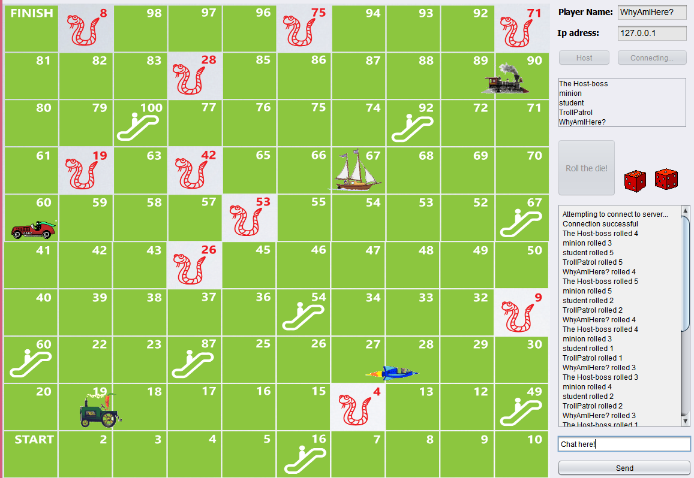

# SnakesAndLadders

This was the first application I ever made that actually did something.
Wrote this in the second year of University. Back then The year before that we were introduced to C, and teaching of Java was lacking to say the least - I spent a week trying to fiogure out how to deallocate memory :D
 

# Contents
'Resources' countains images and a jar. You can use it to run the game. There is also a pdf which was my school report, it explains the game in detail. 

# Issues
There is a bug somewhere in the threading code, that causes the player figure's visual position to drift from it's actual place.
That is probably related to the ridiculous way in which animation is implemented: I created a thread per figure on the board, and animate them by moving the figure a little, then sleeping the thread, then moving the figure a little, etc. 

